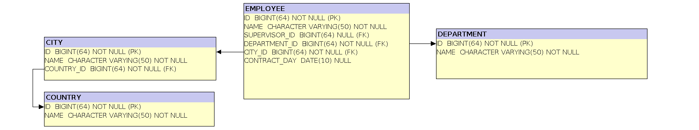

# Demo project for Kotlin ORM(s)

A simple Kotlin project to test two ORM frameworks: [Expose](https://github.com/JetBrains/Exposed/wiki/DAO) and [Ktorm](https://www.ktorm.org/en/schema-definition.html).
The application is based on [Spring Boot](https://spring.io/projects/spring-boot) framework.

## Entity model:

## How to run:

1. Set Java environment to version 17, for example:  
`export JAVA_HOME=/opt/java/amazon-corretto-17.0.1.12.1-linux-x64`
2. Run maven: `./mvnw spring-boot:run`
3. Open browser: `firefox` http://localhost:8080/

## License 

Apache License, Version 2.0

## Links

1. [Exposed tutorial](https://github.com/JetBrains/Exposed/wiki/DAO)
2. [Ktorm tutorial](https://www.ktorm.org/en/entities-and-column-binding.html)
3. [How we use Kotlin with Exposed at TouK](https://touk.pl/blog/2019/02/12/how-we-use-kotlin-with-exposed-at-touk/) (blog)
